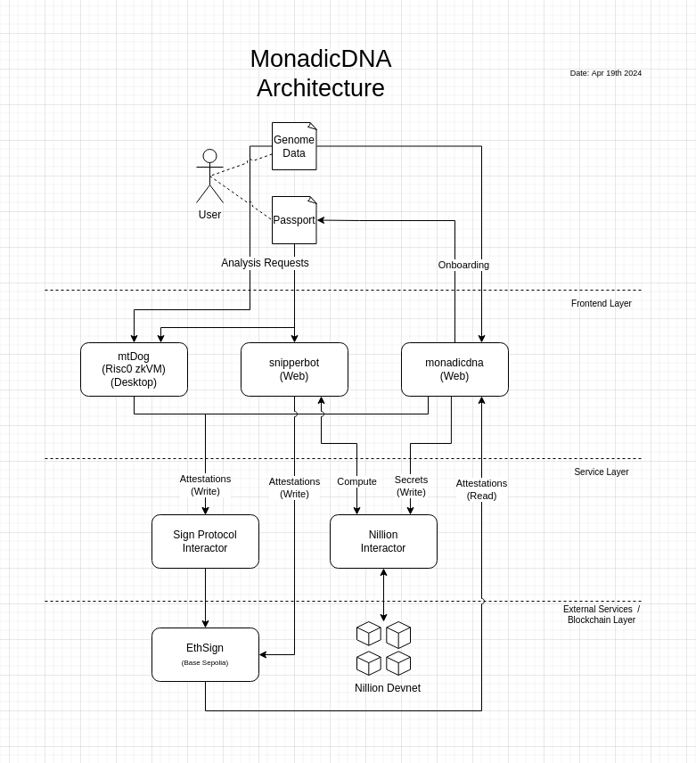

# Monadic DNA

Secure and sovereign personal genomics

*This project was initiated at the [Scaling Ethereum 2024](https://ethglobal.com/events/scaling2024) hacakthon.*

Personal genomics services such as 23andMe and Ancestry.com have been delivering valuable health and ancestry insights to us. However, by using insecure methods and having a general lack of care, they have exposed our most critical biological data through breaches and unscrupulous sharing. Unlike national identifiers and even our names, we cannot change our DNA after a breach. Worse, genetic data can reveal some fundamental information about us which can be used to harm us in targeted ways. All this has made many people reluctant to use genomics for better healthcare, IVF, etc. 

Our project, Monadic DNA, is an illustrative example of what a new paradigm of privacy respecting personal genomic services might look like. With three different tools using the latest in blind computing and zero knowledge technology we show what the whole ecosystem looks like when we prioritize user privacy. We envision a future in which people own their own genomic data with no compulsion to reveal it to any providers and still enjoy the benefits of this rapidly evolving field. 

## Flows

Once someone obtains their raw DNA file from a provider, the Monadic DNA Portal at https://monadicdna.com allows them to upload  their data and receive a DNA Passport. In the background, the raw data is processed (and then discarded) and portions of it are stored as secrets on the [Nillion](https://nillion.com/) network. Since the data is also validated a ValidDataset attestation (https://testnet-scan.sign.global/schema/onchain_evm_84532_0x4e) is issued for the dataset using [Sign Protocol](https://sign.global/). The actual DNA Passport handed back to the user contains an identifier, some useful hashes and metadata about stored secrets on the Nillion network. The Portal and the Passport act as the focal points of the ecosystem.

SnipperBot (https://snipperbot.xyz) is an exemplar service we built to show a better version of 23andMe using Monadic DNA. SnipperBot accepts DNA Passports from users and uses the metadata to run a program on the users’ datasets. This program operates on encrypted data so no user data is ever revealed to SnipperBot, neither raw genetic information nor identity information about users. After performing the available computations, SnipperBot issues a VerifiedTrait (https://testnet-scan.sign.global/schema/onchain_evm_84532_0x4f) attestation to the given user with the results. We are using genetic thrombophilia as an example trait right now and several other traits can be easily added as needed. 

mtDog (https://mtdog.xyz) is another exemplar service we built as a novel new way to process private genomic data. As the human genome is quite long, it may be prohibitive to store it and compute on it using confidential computing. Instead, mtDog offers a desktop application which uses [RISC Zero](https://www.risczero.com/) to provably run genomic analysis. After accepting a DNA passport and an encrypted dataset, the mtDog application runs a verifiable program locally using RISC Zero, shows the result to the user and (optionally) writes the result as an attestation using Sign Protocol. We are using Type 2 Diabetes as an example trait right now as it needs multiple genes to be processed and several other traits can again be easily added as needed. 

The results from multiple services such as SnipperBot and mtDog can be viewed together in the Results section of Monadic DNA by uploading DNA Passports. Each result corresponds to an attestation pulled using Sign Protocol. Only providers such as Snipperbot and mtDog that have been vetted by Monadic DNA through a VerifiedProvider attestation (https://testnet-scan.sign.global/schema/onchain_evm_84532_0x50) can have their results displayed on the Portal. Thus, using Sign  Protocol, we establish a chain of trust with Monadic DNA at the root. We are currently displaying the results as simple tiles but, in the future, each result could be exported as a PDF with extensive detail fit for a medical provider. Hospitals and medical systems who are clued in could also themselves verify the receipts generated by RISC Zero that are included in the result attestations. 

Onchain attestations based on offchain computation provide an open, scalable paradigm for medicine which respects anonymity and privacy. Through the magic of MPC, we use confidential computing to operate on occluded user data on the Cloud while, using ZK we use verifiable computing to run more substantial computations on raw data on the users’ own devices. 

## Technicals

The project uses actual dumps of genetic data from 23andMe. Other providers’ file formats can also be easily supported. These files don’t contain the whole genetic sequence (which would be absolutely gigantic) but rather contain information about half a million single nucleotide polymorphisms (SNPs), e.g. rs6025, and their genotypes, e.g. AA, AG, GG, etc. Based on the SNP / genotype pairs we store, we are able to make deductions about health and ancestry traits of users, the same way that 23andMe and other services do.  

As mentioned, we used Nillion for confidential computing. As Nillion is still being scaled, we kept things as simple as possible and only stored selected SNPs on the network for computation. We also did a lot of operational work to wrap a remote Nillion node with a simple API to keep things stable. As Nillion secrets can’t yet be shared between multiple programs, we run a program for a single trait. The moment the constraint is removed, we will be able to run a plethora of programs on the secret data. Finally, the Nillion infrastructure requires some shepherding at the moment so we ask people to contact us if they have any issues trying the whole system for themselves.

RISC Zero is used for verifiable computation. Due to privacy concerns, we could not use the Bonsai prover that RISC Zero offers for much more efficient performance. We therefore stuck to a relatively less intense analysis of type 2 diabetes for now. Once the local prover becomes more efficient, we will be able to pack in whole genome analysis into the software. 

Sign Protocol is used for setting up a chain of trust and encoding results as onchain data. We set up three schemas mentioned above for the chain of trust. For mtDog, we set up a simplified proxy API for Sign Protocol as the software is written in Rust to support RISC Zero and porting over the Sign Protocol libraries over to rust was too heavy a lift for the hackathon. All attestations are written on Base Sepolia for now. 

The apps for Monadic DNA and SnipperBot are written in TypeScript using Next.js. The mtDog Rust UI uses a GUI framework called egui We considered rendering our RISC Zero Rust program to WASM so even the mtDog UI could be written in Node.js but the effort involved would be too great for a hackathon. 
